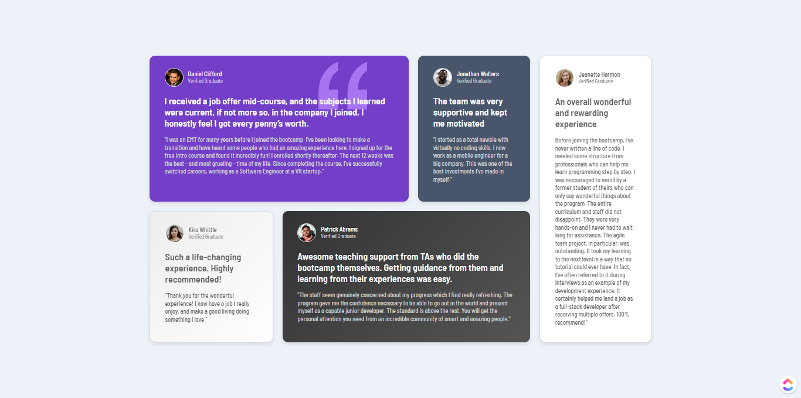
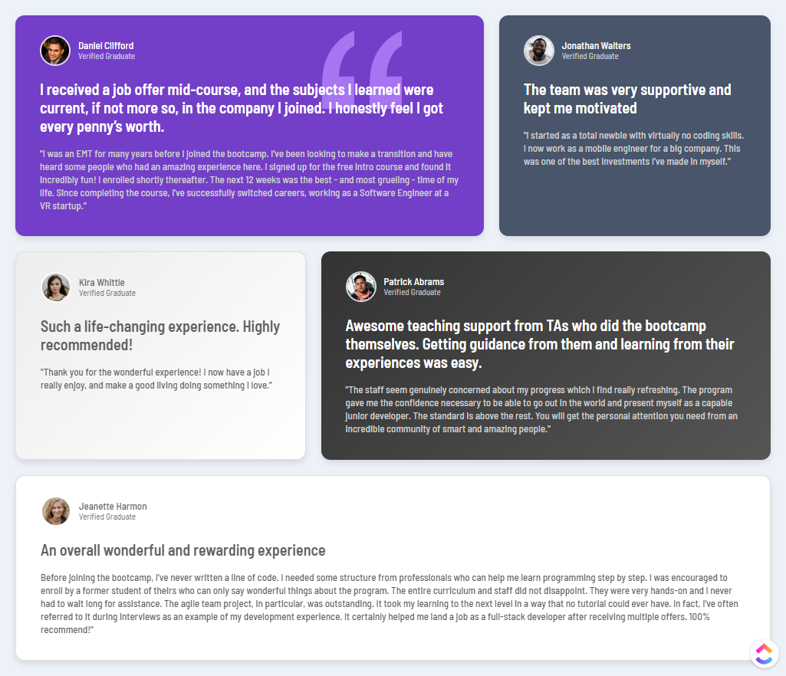
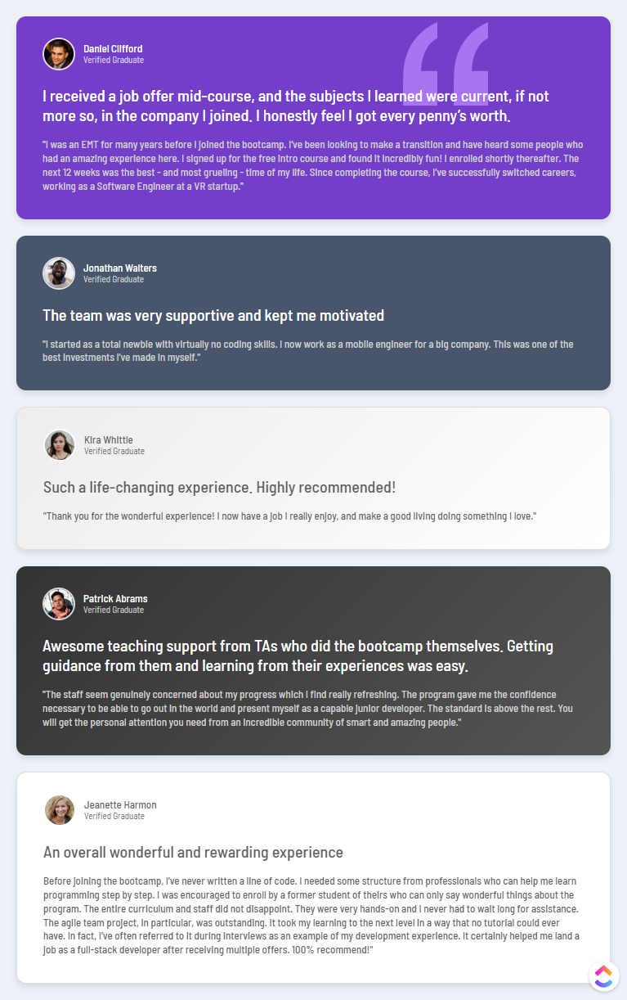

# Frontend Mentor - Testimonials Grid Section Solution

## Welcome! 👋

Thank you for checking out this front-end coding challenge.

This is a solution to the [Testimonials Grid Section challenge on Frontend Mentor](https://www.frontendmentor.io/challenges/testimonials-grid-section-Nnw6J7Un7 ). These challenges help you build real-world projects and enhance your front-end development skills.

## Table of Contents

- [Overview](#overview)
  - [The Challenge](#the-challenge)
  - [Screens](#screens)
  - [Links](#links)
- [My Process](#my-process)
  - [Built With](#built-with)
  - [What I Learned](#what-i-learned)
  - [Code Snippet](#code-snippet)

## Overview

### The Challenge

Your users should be able to:

- View the optimal layout for the testimonials grid depending on their device's screen size.
- See hover states for all interactive elements on the page.
- Experience a responsive design with a clean, professional look.

### Screens

#### Desktop Preview
  

#### Tablet Preview
  

#### Mobile Preview
  

### Links

- Solution URL: [GitHub Repository](https://github.com/harisdev-netizen/testimonials-grid-section)
- Live Site URL: [Live Demo](https://testimonials-grid-sec.netlify.app/)

## My Process

### Built With

- Semantic HTML5 markup
- CSS custom properties
- CSS Grid for layout
- Mobile-first workflow
- Responsive design techniques
- [Google Fonts](https://fonts.google.com/) - For custom typography

### What I Learned

This project enhanced my understanding of:

- Creating responsive grid layouts using `grid-template-areas`.
- Utilizing CSS custom properties for theme-based design.
- Building hover effects with transitions for an interactive user experience.
- Applying media queries for seamless design on different screen sizes.

Have fun building! 🚀
